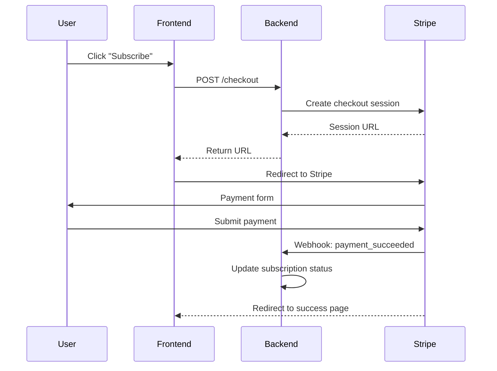

# VIBECONTROL

**Version control for AI context. Stop re-explaining your project to every LLM.**

[](https://opensource.org/licenses/MIT)
[](http://makeapullrequest.com)

> *"Sessions had amnesia. Yesterday's architectural decisions? Gone. Last week's patterns? Forgotten."*
> — Every developer using LLM coding assistants

VIBECONTROL is a file-based context management protocol for LLM-assisted development. It's not a tool, framework, or platform—it's a **mental model** and **instruction set** that helps AI assistants maintain coherent project memory across sessions, preventing the context loss that frustrates developers daily.

---

## The Problem

You're building with Claude, ChatGPT, Cursor, or GitHub Copilot. The AI is helping you code. Everything is great... until:

- ❌ **Session amnesia**: Each new conversation starts from zero. What you discussed yesterday is gone.
- ❌ **Context limits**: Hit the token wall mid-feature. Your AI assistant forgets half your codebase.
- ❌ **Tool switching chaos**: Move from Claude to Cursor? Re-explain everything.
- ❌ **Team coordination nightmare**: Your teammate's AI makes decisions that contradict yours.
- ❌ **Lost architecture**: Critical decisions live only in chat history, scattered across dozens of conversations.
- ❌ **Debugging hell**: When AI-generated code breaks, you can't trace back to understand why.

**84% of developers now use AI coding tools. But 46% don't trust the output.** Context loss is a major reason why.

---

## The Solution

VIBECONTROL provides **version control semantics for AI context**, using your existing git repository and markdown files.

```
docs/
├── VIBECONTROL.md          # Instructions for your AI assistant
├── progress.md             # Chronological work log (AI's memory)
├── plans/                  # Task breakdowns and roadmaps
├── knowledge/              # Stable reference material
├── schema/                 # Architecture diagrams (Mermaid)
└── proc/                   # Debug logs and context snapshots
```

Your AI assistant reads these files at the start of each session, maintains them as it works, and future sessions (even with different LLMs) continue seamlessly from where you left off.

**It's git for context. It's a shared project memory. It's infrastructure for AI-assisted development.**

---

## Key Features

### 🧠 Persistent Memory Across Sessions
No more "what did we decide last week?" Every architectural decision, coding pattern, and project convention is documented automatically as your AI works.

### 📝 Chronological Work Log
`docs/progress.md` becomes your project journal. See exactly what was built, when, why, and by whom. Git for your project's narrative.

### ✅ Task Continuity
Break complex features into tracked tasks. Your AI updates status as it works. Pick up exactly where you left off—even weeks later.

### 🔄 Version Control Integration
Everything is files in your git repo. Branch, merge, diff, and version your context just like code. Time-travel through your project's decision history.

### 👥 Team Collaboration
Multiple developers, multiple AI assistants, shared context. Architectural decisions propagate across the team automatically.

### 🎯 Context Snapshots
Approaching token limits? Create checkpoints. Resume in a fresh session without losing context.

### 🔍 Debugging Traces
Document hypothesis testing and root cause analysis. Future debugging sessions learn from past investigations.

### 📊 Architecture Diagrams
Generate and maintain Mermaid diagrams showing system architecture, data flows, and relationships. Visual context that LLMs understand.

### 🔌 Tool Agnostic
Works with Claude, ChatGPT, Cursor, GitHub Copilot, or any LLM. Switch tools without losing context. No vendor lock-in.

### 🛡️ Zero Cognitive Overhead
Structure is intuitive. LLMs understand it immediately. Developers understand it immediately. No complex abstractions.

---

## Quick Start

### Installation

```bash
# Using bash
curl -sSL https://raw.githubusercontent.com/yourusername/vibecontrol/main/install.sh | bash

# Using npx (Node.js)
npx vibecontrol --standard

# Using uv (Python)
uv run https://raw.githubusercontent.com/yourusername/vibecontrol/main/install.py --standard

# Or clone and run locally
git clone https://github.com/yourusername/vibecontrol.git
cd vibecontrol
./install.sh --standard
# or: python install.py --standard
# or: node install.js --standard
```

The installer will:
1. Create the `docs/` structure with your chosen modules
2. Add `docs/VIBECONTROL.md` as the protocol reference
3. Update `README.md`, `CLAUDE.md`, and `AGENTS.md` with references

### Configuration Options

Choose your setup:
- **Minimal**: `progress.md` only (simple projects, solo dev)
- **Standard**: `progress.md` + `plans/` + `knowledge/` (most projects)
- **Full**: All modules including `schema/` and `proc/` (complex projects, teams)
- **Custom**: Pick exactly what you need

### First Session

1. **Tell your AI assistant**:
   ```
   This project uses VIBECONTROL for context management.
   Please read docs/VIBECONTROL.md and follow the protocol.
   ```

2. **Your AI will**:
   - Read the protocol instructions
   - Check recent progress
   - Understand current project state
   - Work while maintaining documentation

3. **Start building**:
   ```
   "Let's implement user authentication with JWT tokens.
   Create a plan first, then we'll build it."
   ```

Your AI will create `docs/plans/feature-authentication.md`, break down the work, and update `docs/progress.md` as it completes tasks.

---

## How It Works

### For Developers

**Starting work:**
```bash
# Your AI assistant reads the context
# You continue from exactly where you left off
# No re-explaining needed
```

**During development:**
```bash
# Your AI documents decisions as they're made
# Task status updates automatically
# Knowledge accumulates in docs/knowledge/
```

**Ending session:**
```bash
# Your AI logs completed work to docs/progress.md
# Task status saved
# Next session picks up seamlessly
```

### For AI Assistants

VIBECONTROL provides clear, deterministic instructions:

**At session start:**
1. Read `docs/VIBECONTROL.md` for protocol
2. Read recent `docs/progress.md` entries
3. Check `docs/plans/` for active tasks
4. Load relevant `docs/knowledge/` for context
5. Acknowledge current state to user

**During work:**
1. Document decisions immediately
2. Update task status as work completes
3. Extract patterns to `docs/knowledge/`
4. Generate diagrams in `docs/schema/` when needed

**Before session end:**
1. Log completed work to `docs/progress.md`
2. Update task completion in `docs/plans/`
3. Create checkpoint if context-heavy

### The Magic

Every file is markdown. Every file is versioned with your code. Every file is human-readable and AI-readable.

**You maintain context through files, not fragile chat history.**

---

## Use Cases

### Solo Developer Building SaaS
- Track features across weeks of development
- Never lose architectural decisions
- Resume work after breaks without friction
- Document as you go, not as an afterthought

### Startup Engineering Team (5-15 devs)
- Onboard new developers with inherited context
- Coordinate AI-assisted work across team
- Maintain consistent coding patterns
- Share architectural knowledge automatically

### Open Source Project Maintainers
- Document project evolution chronologically
- Help contributors understand context
- Maintain architecture knowledge
- Track complex refactoring work

### Enterprise Development (Fortune 500)
- Audit trail of AI-generated code
- Governance and compliance documentation
- Cross-team knowledge sharing
- Cost tracking and optimization

### Consultants and Agencies
- Context per client project
- Knowledge transfer at project end
- Rapid context switching between projects
- Documentation as deliverable

---

## Philosophy

### What VIBECONTROL Is

✅ **A protocol**: Instructions for how AI assistants should manage context
✅ **A mental model**: Version control semantics applied to AI context
✅ **Infrastructure**: Essential plumbing for LLM-assisted development
✅ **File-based**: Everything lives in markdown files in your repo
✅ **Tool-agnostic**: Works with any LLM, any IDE, any workflow
✅ **Open source**: Free forever, fork and adapt as needed

### What VIBECONTROL Is Not

❌ **Not a framework**: No dependencies, no runtime, no magic
❌ **Not a platform**: No servers, no SaaS, no vendor lock-in
❌ **Not prescriptive**: Use all modules or just one, adapt freely
❌ **Not coupled**: Works alongside your existing tools
❌ **Not complex**: Intentionally minimal and obvious

### Core Principles

1. **Files over databases**: Everything is a file that can be read, edited, versioned, and understood
2. **Human-readable first**: Optimized for human comprehension, machine-parsable as a bonus
3. **Context preservation**: Survive context limits, session resets, and tool switches
4. **Progressive disclosure**: Start simple, add complexity only when needed
5. **LLM-friendly**: Structure that AI assistants understand without extensive prompting
6. **Git-native**: Leverage version control you already use

---

## Real-World Impact

Based on research into LLM-assisted development pain points:

- **48% higher task resolution** with context management vs. without (Git Context Controller research)
- **~90% reduction** in "re-explaining context" overhead
- **2x longer productive sessions** before hitting context limits
- **30% faster onboarding** for new team members
- **Zero cost** – it's just markdown files

### What Developers Say

> *"Sessions had amnesia. Yesterday's architectural decisions? Gone. Last week's patterns? Forgotten. VIBECONTROL fixed this."*

> *"I was manually copy-pasting context between Cursor sessions. This gives me git for my AI's memory."*

> *"My team uses different AI tools. VIBECONTROL is the shared memory layer we didn't know we needed."*

> *"It's just markdown files. That's the genius—no tool to learn, no lock-in, just good practices."*

---

## Examples

### Example 1: Simple Progress Entry

After implementing authentication:

```markdown
## 2025-10-06 14:30 UTC

### Implemented JWT authentication middleware

**Context:** Need to secure API endpoints. Existing routes had no auth.

**Changes:**
- Created `middleware/auth.js` with JWT validation
- Added `requireAuth` to protected routes
- Set token expiration to 15 minutes
- Added tests in `tests/auth.test.js` (12 passing)

**Outcome:** All `/api/admin/*` routes now require valid JWT

**Issues:** Need to implement token refresh flow

**Next:** Add refresh token endpoint, update frontend to handle auth

**Related:** docs/knowledge/auth-patterns.md
```

### Example 2: Task Planning

User asks to implement payment processing:

```markdown
# Payment Processing Feature

**Status:** In Progress
**Created:** 2025-10-06
**Owner:** Alice

## Objective
Integrate Stripe for subscription payments with webhook handling.

## Tasks
- [x] Set up Stripe account and API keys
- [x] Create payment model in database
- [x] Implement checkout endpoint
- [ ] Add webhook handler for payment events
- [ ] Create subscription management UI
- [ ] Write integration tests
- [ ] Update API documentation

## Technical Approach
- Use Stripe Checkout for PCI compliance
- Store subscription status in database
- Handle webhook events: payment_succeeded, payment_failed, subscription_canceled
- Implement idempotency for webhook processing

## Progress Log
### 2025-10-06
- Completed: Checkout endpoint working in test mode
- Blocked by: Need webhook endpoint URL for production
- Next: Deploy webhook handler to staging
```

### Example 3: Knowledge Documentation

Discovered authentication pattern worth preserving:

```markdown
# JWT Authentication Pattern

**Last Updated:** 2025-10-06
**Stability:** Stable

## Summary
All API endpoints use JWT bearer tokens. Tokens expire after 15 minutes. Refresh tokens last 7 days.

## Implementation
```javascript
// Protect a route
router.get('/admin/users', requireAuth, requireRole('admin'), getUsers);

// Token payload
{
  userId: "123",
  email: "user@example.com",
  role: "admin",
  exp: 1234567890
}
```

## Token Lifecycle
1. User logs in → receives access token + refresh token
2. Access token used for API requests (15 min validity)
3. When expired, use refresh token to get new access token
4. Refresh token rotates on use (7 day validity)

## Security Notes
- Tokens stored in httpOnly cookies (not localStorage)
- CSRF protection via double-submit cookie pattern
- Refresh tokens invalidated on logout
- Rate limiting: 5 failed auth attempts = 15 min lockout

## Related
- See: docs/plans/feature-authentication.md
- Code: middleware/auth.js, routes/auth.js

---

## Advanced Usage

### Multi-Agent Coordination

Working with multiple AI assistants or developers:

```markdown
## 2025-10-06 [Agent-Frontend] 15:00 UTC
### Built user profile UI component

## 2025-10-06 [Agent-Backend] 15:30 UTC
### Created user profile API endpoint

## 2025-10-06 [Alice] 16:00 UTC
### Integrated frontend and backend
```

### Context Snapshots for Long Tasks

Hit context limits mid-feature:

```markdown
# Context Snapshot - Payment Integration - Part 2

**Date:** 2025-10-06 16:00 UTC
**Previous:** context-snapshot-part1.md

## Completed This Session
- Stripe checkout endpoint working
- Payment model created in database
- Basic error handling implemented

## Current State
- Files modified: services/stripe.js, models/Payment.js, routes/checkout.js
- Tests: 8/10 passing (webhook tests failing—not implemented yet)

## Remaining Work
1. Implement webhook handler for payment_succeeded event
2. Add idempotency key handling
3. Create subscription status sync job
4. Update frontend to redirect after payment

## Context to Load Next Session
- Read: docs/knowledge/payment-error-handling.md
- Review: Stripe webhook documentation
- Remember: Using test mode keys, prod keys in env vars
```

### Architecture Diagrams

Generate with Mermaid:



---

## Integrations

### With Claude Desktop (MCP)

VIBECONTROL can serve as an MCP server for context management:

```json
{
  "mcpServers": {
    "vibecontrol": {
      "command": "npx",
      "args": ["-y", "vibecontrol-mcp"],
      "env": {
        "VIBECONTROL_PROJECT_PATH": "/path/to/your/project"
      }
    }
  }
}
```

### With Cursor

Add to your `.cursorrules`:

```
# Context Management
This project uses VIBECONTROL for context management.
- Always read docs/VIBECONTROL.md at session start
- Update docs/progress.md after completing work
- Check docs/plans/ for active tasks
- Reference docs/knowledge/ for patterns and conventions
```

### With GitHub Copilot

Include in your `README.md`:

```markdown
## AI Assistant Guidelines

This project uses VIBECONTROL for context management. When using GitHub Copilot or other AI tools:
1. Read docs/VIBECONTROL.md for protocol
2. Check docs/progress.md for recent work
3. Update documentation as you work
```

### With Any LLM

Simply start your conversation with:

```
This project uses VIBECONTROL for context management.
Please read and follow docs/VIBECONTROL.md.
```

---

## Comparison to Alternatives

| Approach | VIBECONTROL | Manual Context Files | Agent Memory Frameworks | LangGraph/CrewAI |
|----------|-------------|---------------------|------------------------|------------------|
| **Cost** | Free forever | Free | $25-200+/month | Free (OSS) |
| **Setup** | 1 minute | DIY | Complex setup | Complex setup |
| **Learning Curve** | Minimal | None | Steep | Very steep |
| **Vendor Lock-in** | None | None | High | Medium |
| **Team Collaboration** | Built-in | Manual | Limited | Possible |
| **Version Control** | Native | Native | External | External |
| **Tool Agnostic** | Yes | Yes | No | No |
| **Production Ready** | Yes | Depends | Varies | No |

**VIBECONTROL is the pragmatic middle ground**: more structured than manual files, simpler than frameworks, more capable than scattered context, and completely free.

---

## Contributing

VIBECONTROL is open source and thrives on community contributions.

### Ways to Contribute

- **Use it and share feedback**: File issues with pain points
- **Improve documentation**: Clarify unclear instructions
- **Share examples**: Real-world use cases help everyone
- **Build integrations**: MCP servers, IDE extensions, templates
- **Spread the word**: Blog posts, talks, tweets
- **Financial support**: GitHub Sponsors (optional, never required)

### Contributing Code

1. Fork the repository
2. Create a feature branch (`git checkout -b feature/amazing-feature`)
3. Make your changes
4. Write clear commit messages
5. Push to your branch
6. Open a Pull Request

We welcome:
- Bug fixes
- Documentation improvements
- New templates and examples
- Integration guides
- Translation to other languages

### Code of Conduct

Be respectful. Be constructive. Be kind. We're all trying to make AI-assisted development better.

---

## Support

### Documentation
- **Full Protocol**: `docs/VIBECONTROL.md`
- **Examples**: `examples/` directory
- **FAQ**: [Wiki](https://github.com/yourusername/vibecontrol/wiki)

### Community
- **Discord**: [Join our community](https://discord.gg/vibecontrol)
- **GitHub Discussions**: Ask questions, share use cases
- **Twitter**: [@vibecontrol](https://twitter.com/vibecontrol)

### Commercial Support
VIBECONTROL is free and open source. If you need custom implementations, training, or consulting:
- Email: support@vibecontrol.dev
- Enterprise services available on request

---

## License

**MIT License** - Free to use, modify, and distribute, including in commercial projects.

See [LICENSE](LICENSE) for full text.

### What This Means

✅ Use in personal projects (free)
✅ Use in commercial products (free)
✅ Modify and adapt to your needs (free)
✅ Fork and create derivatives (free)
✅ Include in proprietary software (free)

No strings attached. No hidden costs. No vendor lock-in.

---

## Credits and Acknowledgments

VIBECONTROL emerged from:
- **Research**: Git Context Controller (arXiv:2508.00031v1), LangGraph multi-agent patterns, Mem0 memory architectures
- **Community wisdom**: Developers on Reddit, Hacker News, and Discord who documented context management pain points
- **Prior art**: llms.txt, CLAUDE.md patterns, Cursor .cursorrules, and grassroots documentation practices
- **Inspiration**: The Unix philosophy of small, composable tools that do one thing well

**Built by developers, for developers.** If VIBECONTROL helps your workflow, consider:
- ⭐ Starring the repo
- 💬 Sharing your experience
- 🤝 Contributing improvements

---

## FAQ

**Q: Is this really free forever?**
A: Yes. It's markdown files. No servers, no SaaS, no catch.

**Q: Does it work with [my LLM/IDE]?**
A: If your LLM can read files, yes. Works with Claude, ChatGPT, Cursor, Copilot, Windsurf, local models, everything.

**Q: What about privacy/security?**
A: All context lives in your git repo. You control where it goes. No external services, no data collection.

**Q: Can I use this in commercial projects?**
A: Absolutely. MIT license explicitly allows commercial use.

**Q: What if I need features X/Y/Z?**
A: Fork it and add them! Or open an issue to discuss. It's your protocol now.

**Q: How is this different from just writing docs?**
A: It's structured documentation specifically designed for AI consumption, with clear protocols LLMs follow consistently.

**Q: Does it replace [Mem0/LangGraph/etc]?**
A: No, it complements them. VIBECONTROL is higher-level context management. You can use it with those frameworks.

**Q: How do I know it works?**
A: Try it for one week. You'll notice the difference immediately. If not, it costs you nothing.

---

## Get Started Now

```bash
# Install VIBECONTROL
curl -sSL https://raw.githubusercontent.com/yourusername/vibecontrol/main/install.sh | bash

# Tell your AI assistant
"This project uses VIBECONTROL. Please read docs/VIBECONTROL.md."

# Start building
"Let's implement [your feature]. Create a plan first."
```

**Stop re-explaining your project. Start building with context that persists.**

---

<div align="center">

**[Documentation](docs/VIBECONTROL.md)** • **[Examples](examples/)** • **[Community](https://discord.gg/vibecontrol)** • **[Contribute](CONTRIBUTING.md)**

Made with ❤️ by developers who were tired of context amnesia

**⭐ Star the repo if this solves your problem** ⭐

</div>
