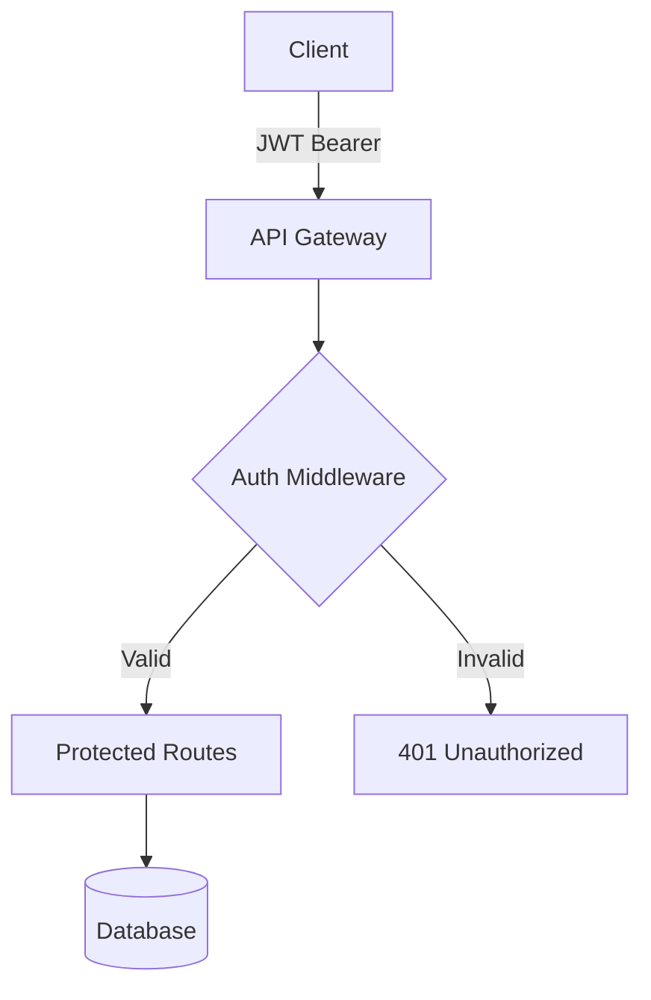

# VIBECONTROL

**Zero-cost context memory for LLM-assisted development.**

Stop paying $29-100/month for what markdown files already do. VIBECONTROL delivers enterprise-grade AI memory using your existing git repository.

[](https://opensource.org/licenses/MIT)
[](http://makeapullrequest.com)

---

## What You Get (For $0)

| Feature | VIBECONTROL | Mem0 Pro | Cursor Pro | Replit Agent |
|---------|-------------|----------|------------|--------------|
| **Persistent memory** | ✅ Free | $29/mo | $20/mo | $25/mo |
| **Multi-session context** | ✅ Free | $29/mo | $20/mo | $25/mo |
| **Team collaboration** | ✅ Free | $49+/mo | $40/mo | Enterprise |
| **Works with all LLMs** | ✅ Free | Limited | Claude only | Replit only |
| **Version controlled** | ✅ Free | Extra $$$ | No | No |
| **Self-hosted** | ✅ Always | Optional | No | No |
| **Privacy (no external calls)** | ✅ Always | Paid tier | No | No |
| **Commercial use** | ✅ MIT license | Restricted | Restricted | Restricted |

**Annual savings vs paid alternatives: $348-1,200+ per developer.**

---

## The Problem

84% of developers now use AI coding assistants. But each session suffers from amnesia:

- ❌ **Session reset**: Yesterday's architectural decisions disappear
- ❌ **Context limits**: Hit token walls, lose critical project knowledge
- ❌ **Tool lock-in**: Switch from Claude to Cursor? Start over
- ❌ **Team chaos**: Teammates' AI assistants make conflicting decisions
- ❌ **Lost architecture**: Decisions scattered across chat history

Developers currently pay $20-100/month per tool for partial solutions. You're still manually copying context, re-explaining projects, and maintaining separate "AI memory" in proprietary platforms.

**VIBECONTROL provides the same memory infrastructure using files you already control.**

---

## The Solution

VIBECONTROL is a protocol—a standardized way to document work so AI assistants maintain context across sessions, tools, and team members.

### Core Architecture

```
docs/
├── VIBECONTROL.md          # Protocol spec (AI reads this first)
├── progress.md             # Chronological memory log
├── plans/                  # Task breakdowns
│   ├── feature-auth.md
│   └── refactor-api.md
├── knowledge/              # Reusable patterns
│   ├── auth-patterns.md
│   └── api-conventions.md
├── schema/                 # Architecture diagrams
└── proc/                   # Debug snapshots
```

**It's version control semantics applied to AI memory.** Everything the AI needs to remember lives in markdown files that git tracks, diff shows, and teams collaborate on.

---

## Installation

```bash
# Clone and install
git clone https://github.com/ser-daniel/vibe-control.git
cd vibe-control
./install.sh --standard

# Or one-line install
curl -sSL https://raw.githubusercontent.com/ser-daniel/vibe-control/main/install.sh | bash
```

The installer creates `docs/VIBECONTROL.md` with protocol instructions and initializes `docs/progress.md` for session logging.

---

## Quick Start

### 1. Install in Your Project

```bash
cd your-project
curl -sSL https://raw.githubusercontent.com/ser-daniel/vibe-control/main/install.sh | bash
```

### 2. Tell Your AI Assistant

```
This project uses VIBECONTROL. Read docs/VIBECONTROL.md and follow the protocol.
```

### 3. Start Working

```
Let's implement user authentication. Create a plan first.
```

**What happens next:**

Your AI will:
1. Create `docs/plans/feature-authentication.md` with task breakdown
2. Implement the feature while documenting decisions
3. Update `docs/progress.md` with completed work
4. Extract reusable patterns to `docs/knowledge/`

### 4. Next Session (Even Weeks Later)

```
Continue working on authentication.
```

Your AI reads recent progress and active plans. It continues exactly where you left off. **No re-explaining needed.**

---

## Real-World Example

### Session 1: October 6, 14:30 UTC

**You:** "Let's add JWT authentication to our API"

**AI creates** `docs/plans/feature-auth.md`:
```markdown
# JWT Authentication Implementation

## Status: In Progress (Started: 2025-10-06)

## Tasks
- [ ] Create auth middleware (In progress)
- [ ] Add token validation
- [ ] Implement refresh flow
- [ ] Write integration tests
- [ ] Update API documentation

## Context
Need to secure /api/admin/* endpoints before launch.
Target: Industry-standard JWT with 15min expiry + refresh tokens.
```

**AI implements middleware and logs to** `docs/progress.md`:
```markdown
## 2025-10-06 14:30 UTC

### Implemented JWT authentication middleware

**Context:** Securing API for production launch

**Changes:**
- Created middleware/auth.js with JWT validation (jsonwebtoken v9.0.2)
- Added requireAuth to 8 protected routes
- Token expiration: 15 minutes
- Tests: 12 passing (tests/auth.test.js)

**Outcome:** All /api/admin/* routes now require valid JWT bearer token

**Issues:** Refresh token endpoint still needed (token expiry causes UX friction)

**Next:** Implement POST /api/auth/refresh with rotating refresh tokens

**Related:** docs/knowledge/auth-patterns.md (created patterns doc)
```

### Session 2: October 7, 09:15 UTC (Different AI tool)

**You:** "Continue working on authentication"

**AI reads progress, sees "refresh token endpoint still needed", continues seamlessly:**

```markdown
## 2025-10-07 09:15 UTC

### Completed JWT refresh token flow

**Context:** Continuing from yesterday's auth middleware work

**Changes:**
- Added POST /api/auth/refresh endpoint
- Implemented rotating refresh tokens (stored in httpOnly cookies)
- Refresh tokens expire after 7 days
- Tests: 18 passing (6 new tests for refresh flow)

**Outcome:** Authentication system complete. Users stay logged in without UX friction.

**Issues:** None. Ready for code review.

**Next:** Security audit of auth implementation

**Related:** docs/plans/feature-auth.md (marked complete)
```

**No context was lost. No re-explaining. Different sessions, maybe even different AI tools, but perfect continuity.**

---

## What Sets VIBECONTROL Apart

### vs. Mem0 ($29/mo Pro, $49/mo Team)
- **Memory storage:** Mem0 uses vector databases (hosted or self-hosted Neo4j/Qdrant). VIBECONTROL uses markdown files in your git repo.
- **Cost:** Mem0 charges for hosted memory and API calls. VIBECONTROL is files—$0 forever.
- **Version control:** Mem0 memories aren't in git. VIBECONTROL memories diff, branch, and merge like code.
- **Privacy:** Mem0 hosted sends data to external servers. VIBECONTROL stays in your repo.
- **Multi-LLM:** Mem0 requires SDK integration. VIBECONTROL works with any LLM that reads files (all of them).

### vs. Cursor's Built-in Memory ($20/mo)
- **Portability:** Cursor memory is proprietary. VIBECONTROL works in Cursor, Claude, ChatGPT, and any future tool.
- **Team sharing:** Cursor memory per-user. VIBECONTROL shared via git—same memory for entire team.
- **Inspection:** Cursor memory is opaque. VIBECONTROL is readable markdown you can audit, diff, and debug.
- **Longevity:** Cursor shuts down? Paywall changes? Your memory is hostage. VIBECONTROL is files you control.

### vs. Replit Agent / Other AI Platforms ($25-100/mo)
- **Lock-in:** Platform-specific agents can't move. VIBECONTROL is tool-agnostic.
- **Cost:** Platforms charge monthly. VIBECONTROL is MIT-licensed files.
- **Data control:** Platforms own your context. VIBECONTROL gives you sovereignty.

### vs. Manual Workarounds (Current Developer Reality)
Most developers currently:
- Maintain CLAUDE.md files manually (inconsistent, forget to update)
- Copy-paste context between sessions (time-consuming, error-prone)
- Re-explain projects every session (frustrating, productivity loss)
- Use @Codebase features that still hit token limits (partial solution)

**VIBECONTROL systematizes these workarounds with AI-maintained documentation and explicit protocols.**

---

## How It Works

### For Developers

#### Session Start
1. Open your AI assistant (Claude, ChatGPT, Cursor, anything)
2. Say: "This project uses VIBECONTROL. Read docs/VIBECONTROL.md"
3. AI loads recent progress and active plans
4. **You continue from exactly where you left off**

#### During Work
- AI documents decisions as they're made (not after)
- Task status updates automatically
- Patterns extracted to reusable knowledge docs
- Context preserved continuously

#### Session End
- AI logs completed work to `progress.md`
- Updates task completion in plans
- Notes next steps for future sessions
- **Context persists in git—committed like code**

### For AI Assistants

`docs/VIBECONTROL.md` contains explicit protocol instructions:

#### At Session Start
1. Read protocol specification
2. Load recent entries from `progress.md` (last 5-10 sessions)
3. Check active tasks in `docs/plans/`
4. Load relevant knowledge from `docs/knowledge/`
5. Acknowledge current project state to developer

#### During Work
1. Document decisions immediately (not "I'll document this later")
2. Update task status in plan files as work progresses
3. Extract reusable patterns to knowledge docs
4. Create proc/ snapshots if approaching context limits

#### Before Session End
1. Log completed work to `progress.md` with timestamp
2. Update task completion in plan files
3. Note next steps and blockers
4. Commit documentation changes

---

## Advanced Features (All Free)

### Team Collaboration

**Without VIBECONTROL:**
- Developer A's AI makes architectural decision in Session 1
- Developer B's AI contradicts it in Session 2
- Conflicts emerge, debugging ensues

**With VIBECONTROL:**
```bash
# Developer A commits memory
git add docs/
git commit -m "Decided on PostgreSQL for user data"
git push

# Developer B pulls memory
git pull

# Developer B's AI reads the decision from docs/progress.md
# Makes consistent choices based on team knowledge
```

### Multi-LLM Workflow

Use different LLMs for different tasks without losing context:

```
Session 1 (Claude): Architectural planning
Session 2 (ChatGPT): Implementation
Session 3 (Local LLama): Code review
Session 4 (Claude): Documentation
```

All sessions share the same `docs/` memory. Each AI continues from where the previous one left off.

### Context Checkpoints

Approaching token limits? AI creates snapshots:

```markdown
# docs/proc/checkpoint-2025-10-06-auth.md

## Context Snapshot: Authentication Implementation

**Active task:** JWT refresh token implementation
**Current state:** Middleware complete, testing refresh endpoint
**Blockers:** None
**Key decisions:**
- 15min access tokens (security)
- 7-day refresh tokens (UX balance)
- httpOnly cookies (XSS protection)

**Files modified:**
- middleware/auth.js
- routes/api/auth.js
- tests/auth.test.js

**Next steps:** Complete refresh endpoint, then security audit
```

If session resets, AI loads checkpoint and resumes.

### Architecture Visualization

```bash
# Generate Mermaid diagram of current architecture
echo "Create a system architecture diagram" | your-ai-tool
```

AI creates `docs/schema/architecture.mmd`:


Diagrams version-control alongside code and memory.

---

## Integrations

### Claude Desktop

Add to your project prompt:
```
This project uses VIBECONTROL for context management.
Read docs/VIBECONTROL.md at session start.
Update docs/progress.md after completing work.
```

### Cursor

Create `.cursorrules`:
```
# VIBECONTROL Integration
- Read docs/VIBECONTROL.md at session start
- Check docs/plans/ for active tasks before suggesting work
- Update docs/progress.md after completing features
- Document patterns in docs/knowledge/
```

### ChatGPT / Any Chat Interface

Start sessions with:
```
This project uses VIBECONTROL. Please:
1. Read docs/VIBECONTROL.md
2. Review recent docs/progress.md entries
3. Acknowledge current project state
```

### CI/CD Integration

Automatically validate memory consistency:

```yaml
# .github/workflows/vibecontrol.yml
name: VIBECONTROL Validation
on: [push, pull_request]
jobs:
  validate:
    runs-on: ubuntu-latest
    steps:
      - uses: actions/checkout@v3
      - name: Validate progress log
        run: |
          # Check that progress.md has entries
          grep -q "##.*UTC" docs/progress.md
      - name: Validate plan status
        run: |
          # Ensure plans have status
          grep -q "Status:" docs/plans/*.md
```

---

## Use Cases

### Solo Developer: Long-Running Feature

**Without VIBECONTROL:**
- Week 1: Start payment integration, context in chat
- Week 2: Hit token limit, start new session, re-explain
- Week 3: Vacation, lose all context
- Week 4: Can't remember what was decided, start over

**With VIBECONTROL:**
- Week 1: AI documents payment architecture in `docs/plans/payment-integration.md`
- Week 2: AI reads plan, continues from last session
- Week 3: Memory in git, survives vacation
- Week 4: AI loads Week 3 progress, continues seamlessly

### Team: Coordinated Multi-Feature Development

**Without VIBECONTROL:**
- Frontend dev's AI: "Let's use REST for this API"
- Backend dev's AI: "Let's use GraphQL for this API"
- Result: Incompatible decisions, wasted work

**With VIBECONTROL:**
- Backend dev's AI documents in `docs/knowledge/api-patterns.md`: "REST for public API, GraphQL for admin"
- Commits to git
- Frontend dev pulls, AI reads patterns, builds compatible frontend
- Result: Consistent architecture across team

### Open Source: Onboard Contributors

**Without VIBECONTROL:**
- New contributor: "What's the coding style?"
- Maintainer: *writes 3 paragraphs*
- Next contributor: *asks same question*

**With VIBECONTROL:**
```bash
git clone project
# docs/knowledge/conventions.md already documents everything
# Contributor's AI reads it, follows established patterns automatically
```

### Consultant: Multiple Client Projects

**Without VIBECONTROL:**
- Monday: Work on Client A, build context
- Tuesday: Switch to Client B, lose Client A context
- Wednesday: Back to Client A, rebuild context from scratch

**With VIBECONTROL:**
```bash
cd client-a-project
# AI reads docs/progress.md, instantly recalls last week's work

cd ../client-b-project
# AI reads different docs/progress.md, switches context perfectly
```

---

## Key Principles

### 1. Files Over Abstractions
Everything is markdown. No proprietary formats, no APIs, no databases. Just text files that git tracks, diff shows, grep searches, and any editor opens.

### 2. Git-Native
Version control your AI's memory like you version control code. Branch, merge, revert, and diff context changes. See who decided what, when, and why.

### 3. LLM-Friendly Format
Markdown with clear structure optimizes for AI comprehension. LLMs excel at reading and writing markdown—so that's the interface.

### 4. Tool-Agnostic
Works with Claude, ChatGPT, Cursor, Copilot, local models, future tools not yet invented. Not coupled to any vendor or platform.

### 5. Progressive Complexity
Start with just `progress.md`. Add `plans/` when managing multi-day features. Add `knowledge/` when patterns emerge. Add `schema/` when visualization helps. Never more structure than needed.

### 6. Zero Dependencies
No frameworks. No servers. No npm packages. No Docker containers. No SaaS subscriptions. Just files and a protocol. Works on any system with a text editor.

---

## What VIBECONTROL Is

- ✅ A protocol for managing AI context
- ✅ Markdown files in your git repository
- ✅ Instructions AI assistants follow consistently
- ✅ Version-controlled project memory
- ✅ Free and open source (MIT license)
- ✅ Tool-agnostic infrastructure

## What VIBECONTROL Is Not

- ❌ A framework with dependencies
- ❌ A SaaS platform with monthly fees
- ❌ Prescriptive or rigid methodology
- ❌ Coupled to specific tools
- ❌ Complex or abstract
- ❌ Replacement for Mem0/LangGraph/etc (it complements them)

---

## Frequently Asked Questions

**Q: Is this really $0 forever?**
A: Yes. It's markdown files in your git repo. There's nothing to charge for. No servers, no API calls, no SaaS.

**Q: How is this different from just writing docs?**
A: It's structured documentation with explicit protocols that AI assistants follow consistently. The structure optimizes for AI memory persistence, not just human reference.

**Q: Does it work with [my LLM]?**
A: If your LLM can read files, yes. Tested with Claude, ChatGPT, local Llama, Mistral, and Cursor. Works with any future LLM that reads text.

**Q: What about privacy and security?**
A: All context lives in your git repository. You control where it's stored, who accesses it, and whether it stays private or goes to external services. No telemetry, no external API calls.

**Q: Can I use this in commercial projects?**
A: Yes. MIT license explicitly allows commercial use without restrictions or royalties.

**Q: How is this better than Mem0/Zep/Letta?**
A: Those are excellent memory frameworks for programmatic agent systems. VIBECONTROL is higher-level: human-readable, version-controlled, tool-agnostic infrastructure that works *with* those frameworks if you want, or standalone if you don't.

**Q: What if I need features X/Y/Z?**
A: Fork the repo and add them. It's MIT licensed—you own your copy. Or open an issue to discuss adding them to the core protocol.

**Q: Does this replace my AI coding assistant?**
A: No, it enhances it. VIBECONTROL gives your assistant persistent memory. You still use Claude, Cursor, ChatGPT, or whatever tool you prefer.

**Q: How do I know it actually works?**
A: Use it for one week on a real project. You'll notice the difference immediately when you don't have to re-explain your architecture. If it doesn't help, you've lost nothing—it's free and reversible (just delete `docs/`).

**Q: What's the catch?**
A: There isn't one. It's files. The only "cost" is the 2 minutes to run the installer and adding "This project uses VIBECONTROL" to your AI prompts.

---

## Documentation

Full protocol specification: `docs/VIBECONTROL.md` (created by installer)
Usage guide: `USAGE.md`
Development guide: `CLAUDE.md`

---

## Contributing

Early-stage open source project. Contributions welcome:

1. Fork the repository
2. Create feature branch: `git checkout -b feature/your-idea`
3. Make changes and test them
4. Submit pull request

**Ideas for contributions:**
- Bug fixes and protocol improvements
- Documentation clarifications
- Example projects demonstrating VIBECONTROL
- Integration guides for specific tools (Windsurf, Aider, etc)
- Templates for different project types (web apps, CLIs, data science, etc)
- Validation scripts for CI/CD
- Migration guides from proprietary memory systems

---

## Repository

- **GitHub:** [ser-daniel/vibe-control](https://github.com/ser-daniel/vibe-control)
- **Issues:** Report bugs and request features via GitHub Issues
- **Discussions:** Share experiences and ask questions in Discussions

---

## License

**MIT License** - Free to use, modify, and distribute, including in commercial projects.

See [LICENSE](LICENSE) for full text.

### What This Means

✅ Use in personal projects (free)
✅ Use in commercial products (free)
✅ Modify and adapt to your needs (free)
✅ Fork and create derivatives (free)
✅ Include in proprietary software (free)
✅ Sell products that use VIBECONTROL (free)

No strings attached. No hidden costs. No vendor lock-in. No attribution required (though appreciated).

---

## Philosophy

VIBECONTROL emerged from practical frustration: paying $29-100/month for AI memory systems while simultaneously version-controlling code in git. Why not apply version control semantics to AI context?

**Core insight:** If you already track your code with git, you already have the infrastructure for AI memory. You just need the protocol.

The market for AI coding tools has raised billions ($100M+ for Cursor, $157B OpenAI valuation, $7.3B for Anthropic). Developers are paying $20-100/month per tool. But context management—the fundamental problem—is solvable with markdown files.

**VIBECONTROL is infrastructure for AI-assisted development, built on tools developers already use and trust.**

---

## Get Started Now

```bash
# Install in your project
curl -sSL https://raw.githubusercontent.com/ser-daniel/vibe-control/main/install.sh | bash

# Tell your AI assistant
"This project uses VIBECONTROL. Read docs/VIBECONTROL.md."

# Start building with persistent context
"Let's implement [your feature]. Create a plan first."
```

**Stop paying $29-100/month for what files already do.
Stop re-explaining your project every session.
Start building with context that persists.**

---

*Built by developers who were tired of re-explaining their projects—and tired of paying for memory that should be free.*
