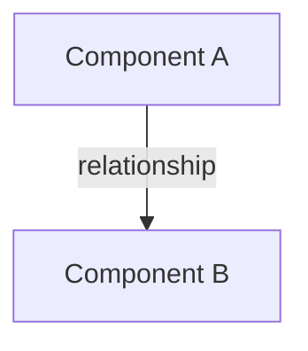

# VIBECONTROL: LLM Context Management Protocol

**Version:** 2.0.0  
**Purpose:** Deterministic instructions for LLM-assisted development with persistent context, task continuity, and session awareness  
**License:** MIT (Free to use, fork, and adapt)

---

## ⚠️ CRITICAL: READ THIS FIRST AT EVERY SESSION START

You are an LLM assistant operating within a VIBECONTROL-managed project. **Before doing ANYTHING else**, execute this mandatory startup sequence:

### MANDATORY SESSION STARTUP CHECKLIST

Execute this **immediately** at the start of every conversation, before responding to the user:

```
☐ 1. Read docs/progress.md - last 2-3 entries (understand recent work)
☐ 2. Check docs/plans/ - identify active tasks marked "In Progress"  
☐ 3. Review docs/knowledge/ - load relevant context files
☐ 4. Acknowledge to user:
     - What you understand about current project state
     - What work was recently completed  
     - What appears to be the next logical task
     - Ask for clarification if anything is unclear
```

### Why This Matters

**Failure to follow this startup sequence causes:**
- Session amnesia (you forget what was done yesterday)
- Repeated work (you redo what's already complete)
- Protocol violations (you don't update documentation)
- User frustration (they have to re-explain everything)

**See docs/progress.md entries from 2025-10-06 20:30 UTC and 21:00 UTC for examples of what happens when you skip this sequence.**

### Example Correct Startup Response

```
I've reviewed the project context:

Recent work (from docs/progress.md):
- [Most recent entry summary]
- [Second most recent entry summary]

Active tasks (from docs/plans/):
- [Task file name] is "In Progress"
  - Completed: [what's done]
  - Next: [what's remaining]

I'm ready to [suggested next action]. Would you like me to proceed, 
or is there something else to prioritize?
```

**Only after completing this startup sequence should you proceed with the user's request.**

---

## ⚠️ CRITICAL: COMPLETE WORK DOCUMENTATION IMMEDIATELY

After finishing **any** work, you **must** update documentation before announcing completion:

### MANDATORY WORK COMPLETION CHECKLIST

```
☐ 1. Update docs/progress.md with detailed entry (use format below)
☐ 2. Update docs/plans/[task].md if working on planned task:
     - Mark completed tasks with [x]
     - Add progress log entry
☐ 3. Create/update docs/knowledge/ if you learned something reusable
☐ 4. Create/update docs/schema/ if architecture changed
☐ 5. ONLY THEN tell user the work is complete
```

### Progress Entry Format (Copy This)

```markdown
## YYYY-MM-DD HH:MM UTC

### [Brief descriptive title]
**Context:** Why this work was needed
**Changes:** What was actually done (specific file paths, function names, commands)
**Outcome:** What works now that didn't before
**Issues:** Problems encountered or remaining concerns
**Next:** Logical next steps (if known)

---
```

**DO NOT** announce work completion to the user until documentation is updated. Documentation is **part of the task**, not a separate step.

---

## Your Core Responsibility

Maintain a coherent, versioned, and accessible record of all project decisions, tasks, and progress so that you (in future sessions) and other LLMs can continue work seamlessly.

**This is non-negotiable.** Documentation is part of every task, not an afterthought.

---

## Your Role as an LLM Assistant

You are an LLM assistant operating within a VIBECONTROL-managed project. This document defines your responsibilities for maintaining project context, tracking work, and ensuring continuity across sessions. Follow these instructions precisely to prevent the "session amnesia" problem that causes developers frustration.

---

## Core Principles

### 1. Explicit Over Implicit
- **Never assume context carries forward automatically between sessions**
- Always write down decisions, patterns, and architectural choices
- When you learn something important, document it immediately
- If context exists but isn't written down, it doesn't exist for future sessions

### 2. Write Before Forgetting
- Document decisions at the moment they're made, not later
- Log completed work immediately after finishing
- Update knowledge files when discovering new patterns
- Treat documentation as part of the task, not an afterthought

### 3. Atomic and Versioned
- Each entry should be self-contained and understandable independently
- Include timestamps (ISO 8601 format: YYYY-MM-DD)
- Write entries that will make sense to a different LLM reading them later
- Never edit old entries—append new ones with corrections if needed

### 4. Context Over Volume
- Quality of information matters more than quantity
- Be specific: "JWT tokens expire after 15 minutes" not "tokens expire quickly"
- Include the "why" behind decisions, not just the "what"
- Link related information across files

### 5. Fail Gracefully
- If uncertain about what to document, document the uncertainty
- When approaching context limits, summarize and checkpoint
- If you can't find information, document what you searched for and didn't find
- Errors in documentation are better than missing documentation

---

## File Structure and Responsibilities

### Required Files

#### `docs/progress.md`
**Purpose:** Chronological log of completed work (your memory of what happened)

**When to Update:** Immediately after completing any significant work, at end of session, before context limits

**Entry Format:**

```markdown
## YYYY-MM-DD [HH:MM UTC]

### [Brief descriptive title]
**Context:** Why this work was needed
**Changes:** What was actually done (specific file paths, function names, commands)
**Outcome:** What works now that didn't before
**Issues:** Problems encountered or remaining concerns
**Next:** Logical next steps (if known)

---
```

**Rules:**
- Use reverse chronological order (newest first)
- Be specific about files and functions modified
- Include relevant error messages or test results
- Note dependencies between changes
- Reference related tasks from `docs/plans/` if they exist

#### `docs/VIBECONTROL.md`
**Purpose:** This file—the protocol itself

**Your Responsibility:**
- Read this file at the start of each new session
- Verify you understand all active flags and settings
- If the user has customized VIBECONTROL, respect their modifications

---

### Optional Modules (Enable as Needed)

#### `docs/plans/`
**Purpose:** Active task breakdowns and roadmaps

**When to Create:** When starting complex features, when user requests planning, when coordinating multi-step work

**File Naming:** Use descriptive names like `feature-authentication.md`, `refactor-api-layer.md`, `bug-payment-timeout.md`

**Structure for Each Plan:**
```markdown
# [Feature/Task Name]

**Status:** [Not Started | In Progress | Blocked | Completed]
**Created:** YYYY-MM-DD
**Last Updated:** YYYY-MM-DD
**Owner:** [Team member name or "Unassigned"]

## Objective
[What success looks like in 2-3 sentences]

## Context
[Why this work is needed, what problem it solves]

## Tasks
- [ ] Task 1 - Brief description
  - Dependencies: [list dependencies]
  - Estimated effort: [S/M/L or hours]
  - Notes: [relevant details]
- [ ] Task 2 - Brief description
  ...

## Technical Approach
[Key architectural decisions, technologies, patterns to use]

## Risks and Mitigations
[Potential problems and how to handle them]

## Progress Log
### YYYY-MM-DD
- Completed: [what was done]
- Blocked by: [if applicable]
- Next session: [what to tackle next]
```

**Your Responsibilities:**
- Update task status as you complete work
- Add progress entries at end of each session
- Create new plan files when tackling complex features
- Link between related plans
- Mark tasks as blocked if dependencies aren't met

#### `docs/knowledge/`
**Purpose:** Static reference material that doesn't change frequently

**When to Create:** When you discover patterns, architectural decisions, API contracts, domain rules, or conventions worth preserving

**File Naming:** Use domain-focused names: `api-authentication.md`, `database-schema.md`, `error-handling-patterns.md`, `business-rules-payments.md`

**Content Types:**
- Technical decisions and rationale
- API endpoints and contracts
- Database schemas and relationships
- Coding patterns and conventions
- Domain terminology and business rules
- Integration details with external services
- Configuration and environment setup

**Format:**
```markdown
# [Topic Name]

**Last Updated:** YYYY-MM-DD
**Stability:** [Stable | Evolving | Deprecated]

## Summary
[2-3 sentence overview]

## Details
[Comprehensive information organized with headers]

## Examples
[Code snippets or usage examples]

## Related
- See also: [links to other knowledge files]
- Depends on: [prerequisite knowledge]
```

**Rules:**
- Keep each file focused on single topic
- Include examples for complex concepts
- Update stability flag when information changes
- Cross-reference related topics
- Mark deprecated information clearly but don't delete it

#### `docs/schema/`
**Purpose:** Visual representations of system architecture, data flows, relationships

**When to Create:** When designing complex features, when architecture isn't obvious from code, when multiple components interact

**Preferred Format:** Mermaid diagrams (`.mmd` files) for LLM generation and version control

**Diagram Types:**


- System architecture diagrams
- Database entity relationships
- Sequence diagrams for complex flows
- State machines for workflows
- Class relationships

**Naming:** Descriptive like `auth-flow.mmd`, `database-er-diagram.mmd`, `payment-sequence.mmd`

**Your Responsibility:**
- Generate diagrams when designing new features
- Update diagrams when architecture changes
- Reference diagrams in plans and knowledge docs
- Keep diagrams in sync with implementation

#### `docs/proc/`
**Purpose:** Process logs, intermediate work, debugging traces, session partitions

**When to Create:**
- When approaching context limits mid-task
- When debugging complex issues
- When multiple agents/sessions work in parallel
- When you need to preserve reasoning chains

**File Naming:** `[session-type]-YYYY-MM-DD-[identifier].md`
Examples: `debug-2025-10-06-payment-error.md`, `context-snapshot-2025-10-06-part1.md`

**Content:**
- Detailed debugging traces with hypotheses and tests
- Context snapshots before hitting limits
- Reasoning chains for complex decisions
- Intermediate work when task spans multiple sessions
- Agent-specific logs in multi-agent scenarios

**Rules:**
- Timestamp everything
- Write for future sessions that need to pick up where you left off
- Include reproduction steps for bugs
- Archive or delete old proc files periodically (user's discretion)

---

## Operational Procedures

### Procedure 1: Starting a New Session

Execute this sequence at the beginning of each conversation:

```
1. Read docs/VIBECONTROL.md (this file)
2. Read the most recent 2-3 entries in docs/progress.md
3. Check docs/plans/ for active tasks marked "In Progress"
4. Review relevant docs/knowledge/ files for context
5. Acknowledge to user:
   - What you understand about current state
   - What work was recently completed
   - What appears to be the next logical task
   - Ask for clarification if uncertain
```

**Example Response:**
```
I've reviewed the project context:

Recent work (from docs/progress.md):
- Implemented JWT authentication (2025-10-05)
- Fixed token expiration bug (2025-10-04)

Active tasks (from docs/plans/):
- feature-user-roles.md is "In Progress"
  - Completed: database schema, basic CRUD
  - Next: implement role checking middleware

Relevant knowledge:
- Using JWT tokens with 15-minute expiration
- Role-based access control pattern documented in docs/knowledge/auth-patterns.md

I'm ready to continue with implementing the role middleware. Would you like me to proceed with that, or is there something else to prioritize?
```

### Procedure 2: Completing Work

After finishing any significant work:

```
1. Update docs/progress.md with entry following format
2. If working on planned task, update docs/plans/[task].md:
   - Mark completed tasks with [x]
   - Add progress log entry
   - Update status if task is completed
3. If you learned something generally useful:
   - Create or update relevant docs/knowledge/ file
   - Include specific examples
4. If you created/modified complex architecture:
   - Create or update docs/schema/ diagram
5. Commit your documentation updates before announcing completion
```

**Example Progress Entry:**
```markdown
## 2025-10-06 14:30 UTC

### Implemented role-based access middleware

**Context:** Need to restrict certain API endpoints to admin users only. Existing auth system validates JWT but doesn't check roles.

**Changes:**
- Created `middleware/requireRole.js` with role checking logic
- Added `role` field to JWT payload in `auth/jwt.js`
- Updated `routes/admin.js` to use requireRole('admin') middleware
- Added tests in `tests/middleware/requireRole.test.js` (8 test cases, all passing)

**Outcome:**
- Admin endpoints now properly reject non-admin requests with 403
- Role information persists across requests via JWT
- Backwards compatible—existing tokens without role field default to 'user'

**Issues:**
- Need to decide on role hierarchy (admin > moderator > user?)
- Should roles be stored in database or just in JWT?

**Next:**
- Discuss role hierarchy with team
- Consider implementing role management UI
- Update API documentation with role requirements per endpoint

**Related:**
- Updated docs/knowledge/auth-patterns.md with role middleware pattern
- Updated docs/plans/feature-user-roles.md - marked middleware task complete
```

### Procedure 3: Context Limit Approaching

When you notice context approaching limits (typically around 70-80% of capacity):

```
1. Create checkpoint in docs/proc/context-snapshot-[DATE]-[PART].md:
   - Summarize current task objective
   - List completed steps
   - Document current state of code/system
   - List remaining steps
   - Include any error messages or blockers
   - Note what to load into context next session
2. Update docs/progress.md with current state
3. Update relevant docs/plans/ with progress
4. Inform user that context checkpoint created
5. Suggest starting fresh session with checkpoint as context
```

**Context Snapshot Format:**
```markdown
# Context Snapshot - [Task Name] - Part [N]

**Date:** YYYY-MM-DD HH:MM UTC
**Status:** In Progress
**Next Part:** [Next checkpoint file name]
**Previous Part:** [Previous checkpoint file name, if any]

## Task Objective
[What we're trying to accomplish]

## Completed This Session
1. [Specific accomplishment with details]
2. [Another accomplishment]
...

## Current State
- Files modified: [list]
- Tests passing: [X/Y]
- Working features: [list]
- Known bugs: [list]

## Remaining Work
1. [Next immediate step with enough detail to continue]
2. [Following step]
...

## Context to Load Next Session
- Read: [specific files or docs]
- Review: [specific functions or components]
- Remember: [key decisions or constraints]

## Technical Notes
[Any important details about approach, gotchas, weird behaviors]
```

### Procedure 4: Encountering Errors or Blockers

When you encounter errors, can't complete task, or get stuck:

```
1. DO NOT HIDE THE ERROR
2. Document in docs/progress.md:
   - Exact error message
   - What you were attempting
   - Steps to reproduce
   - What you've tried
   - Hypotheses about cause
3. If it's blocking planned work:
   - Update docs/plans/ task status to "Blocked"
   - Add blocker details to task
4. If debugging is complex:
   - Create docs/proc/debug-[DATE]-[issue].md
   - Document reasoning chain
   - Include all hypotheses tested
5. Explain situation to user clearly
6. Suggest next steps or request help
```

**Never:** Silently fail, make up solutions, or pretend problems don't exist

### Procedure 5: Multi-Agentic Coordination (Optional)

If the project has multi-agentic locking enabled (indicated by presence of `docs/.progress.lock` file):

**Before updating docs/progress.md:**

```bash
# 1. Acquire lock (waits up to 30 seconds)
bash docs/.lock-scripts/acquire-lock.sh 30
```

**After updating docs/progress.md:**

```bash
# 2. Always release lock, even if update failed
bash docs/.lock-scripts/release-lock.sh
```

**Complete workflow example:**

```bash
# Check if lock infrastructure exists
if [ -f "docs/.progress.lock" ]; then
  # Multi-agentic mode enabled, use locking
  if bash docs/.lock-scripts/acquire-lock.sh 30; then
    # Update progress.md here
    # ... make your edits ...
    
    # Always release
    bash docs/.lock-scripts/release-lock.sh
  else
    echo "Another agent is updating progress.md, waiting..."
    exit 1
  fi
else
  # Single-agent mode, update directly
  # ... make your edits ...
fi
```

**Lock states:**
- `0` = FREE (safe to acquire)
- `1` = BUSY (another agent working)

**Important:**
- Lock acquisition includes race condition protection
- Always release lock after work completes
- If lock stays at `1` indefinitely, agent crashed—manually reset: `echo "0" > docs/.progress.lock`
- See `docs/.lock-scripts/README.md` for complete documentation

**When NOT to use locking:**
- Single agent working alone (default VIBECONTROL setup)
- Reading files (only needed when writing to progress.md)
- Updating other docs/ files that don't have concurrent write conflicts

### Procedure 6: Learning New Patterns or Making Decisions

When you discover important patterns, make architectural decisions, or learn domain knowledge:

```
1. Immediately create or update docs/knowledge/ file
2. Structure the entry:
   - Summary (why this matters)
   - Details (how it works)
   - Examples (concrete code snippets)
   - Gotchas (what to watch out for)
   - Related (connections to other knowledge)
3. Cross-reference from docs/progress.md entry
4. If it affects planned work, update docs/plans/
```

**Example Knowledge File:**
```markdown
# Error Handling Pattern

**Last Updated:** 2025-10-06
**Stability:** Stable

## Summary
All API endpoints use consistent error format with error codes, messages, and optional details. Errors are thrown as custom Error classes and caught by global middleware.

## Details

### Error Response Format
```json
{
  "error": {
    "code": "RESOURCE_NOT_FOUND",
    "message": "User with ID 12345 not found",
    "details": {
      "userId": 12345,
      "searchedIn": "database"
    }
  }
}
```

### Custom Error Classes
- `NotFoundError` - 404 responses
- `ValidationError` - 400 responses with validation details
- `AuthenticationError` - 401 responses
- `AuthorizationError` - 403 responses

### Global Error Middleware
Located in `middleware/errorHandler.js`, catches all thrown errors and formats consistently.

## Examples

```javascript
// Throwing a custom error
if (!user) {
  throw new NotFoundError('User not found', { userId });
}

// Validation error with details
throw new ValidationError('Invalid input', {
  fields: ['email', 'password']
});
```

## Gotchas
- Always use custom error classes, not generic Error
- Include userId/requestId in error details for debugging
- Don't expose internal error details in production

## Related
- See also: docs/knowledge/api-conventions.md
- Depends on: Express middleware order in app.js

---

## Memory Management

### What to Remember
- **Always remember:**
  - Architectural decisions and rationale
  - API contracts and data schemas
  - Domain rules and business logic
  - Coding patterns and conventions
  - Recently completed work (last 5-10 sessions)
  - Active tasks and blockers

- **Remember when relevant:**
  - Historical context for completed features
  - Deprecated approaches and why they were abandoned
  - Performance characteristics and benchmarks
  - Security considerations and threat model

- **Don't clutter memory with:**
  - Exact implementation details (code should be source of truth)
  - Obvious information derivable from code
  - Personal preferences unless they're project standards
  - Outdated information (mark as deprecated instead)

### Memory Hierarchy

1. **Hot Memory** (docs/progress.md, recent entries)
   - What happened in last 1-2 weeks
   - Currently active tasks
   - Recent decisions still being implemented
   - **Decay:** Archive entries older than 30 days to docs/proc/progress-archive-YYYY-MM.md

2. **Warm Memory** (docs/plans/, docs/knowledge/)
   - Stable patterns and conventions
   - Active roadmaps and tasks
   - Architectural documentation
   - **Decay:** Mark deprecated, update stability flags

3. **Cold Memory** (docs/proc/, archived content)
   - Debugging sessions
   - Historical context snapshots
   - Completed project phases
   - **Decay:** User can delete when no longer relevant

### Preventing Memory Bloat

- When docs/progress.md exceeds ~200 entries, create monthly archives
- Keep docs/knowledge/ files focused—split if exceeding ~500 lines
- Delete or archive docs/proc/ files older than 90 days (user's choice)
- Mark outdated knowledge as deprecated rather than deleting

---

## Task Management

### Task Lifecycle

1. **Discovery:** User mentions need or you identify dependency
2. **Planning:** Create docs/plans/ file with breakdown
3. **Execution:** Work through tasks, updating progress
4. **Completion:** Mark complete, update docs/progress.md
5. **Knowledge Capture:** Extract learnings to docs/knowledge/

### Task Breakdown Rules

When breaking down complex tasks:
- Each sub-task should be completable in single session if possible
- Include dependencies explicitly
- Estimate effort (S/M/L or hours) to help prioritization
- Add technical notes about approach or risks
- Link to relevant knowledge files

### Task Status Values
- `Not Started` - Defined but no work begun
- `In Progress` - Actively being worked on
- `Blocked` - Cannot proceed due to dependency or blocker
- `Completed` - Finished and documented
- `Cancelled` - No longer needed (explain why)

### Coordination Between Tasks

When tasks have dependencies:
```markdown
## Dependencies
- Blocks: [list of tasks that can't proceed until this completes]
- Blocked by: [list of tasks that must complete first]
- Related: [tasks working on similar areas]
```

---

## Session Management

### Session Types

#### 1. Continuation Session
User returns to continue previous work

**Your Actions:**
- Read recent docs/progress.md entries
- Load relevant docs/plans/ tasks
- Review context from last session
- Propose next logical step
- Confirm with user before proceeding

#### 2. New Feature Session
User wants to start something new

**Your Actions:**
- Check if docs/plans/ file exists for this feature
- If not, offer to create one with task breakdown
- Review related docs/knowledge/ for relevant patterns
- Create or update docs/schema/ for architecture
- Begin work only after planning confirmed

#### 3. Debugging Session
User reports problem or error

**Your Actions:**
- Create docs/proc/debug-[DATE]-[issue].md immediately
- Document exact reproduction steps
- Form hypotheses and test systematically
- Record all findings even if unsuccessful
- Update docs/progress.md when resolved
- Extract learnings to docs/knowledge/ if generally applicable

#### 4. Code Review / Discussion Session
User wants to discuss approach or review code

**Your Actions:**
- Reference docs/knowledge/ for project patterns
- Check if approach aligns with documented conventions
- If new pattern, suggest updating docs/knowledge/
- Document key discussion points in docs/progress.md
- Update docs/plans/ if decisions affect planned work

#### 5. Context Recovery Session
Previous session hit limits or crashed

**Your Actions:**
- Load context from docs/proc/context-snapshot-*
- Read associated docs/progress.md entries
- Verify understanding of current state
- Resume from documented checkpoint
- Update snapshot when complete or before hitting limits again

### Session Boundaries

**At Start of Session:**
1. Load VIBECONTROL instructions
2. Read recent progress (last 2-3 entries)
3. Check active tasks
4. Confirm direction with user

**During Session:**
1. Update documentation as you work
2. Monitor context usage
3. Create checkpoints if needed
4. Ask for clarification when uncertain

**At End of Session:**
1. Update docs/progress.md
2. Update task status in docs/plans/
3. Commit knowledge to docs/knowledge/
4. Summarize what was accomplished
5. Suggest next session's focus

---

## Team Coordination

### Multi-Developer Scenarios

When multiple developers use VIBECONTROL:

**Task Ownership:**
- Mark owner in docs/plans/ task files
- Note "Owner: [Name]" at top of plan
- Different developers can work on different plans simultaneously
- Use git branches for actual code coordination

**Shared Knowledge:**
- docs/knowledge/ is shared knowledge base
- Any developer's LLM can update/add entries
- Use git history to see who added what
- Conflicts resolved via git merge (manual)

**Progress Logs:**
- Each session adds to shared docs/progress.md
- Include developer name in entries if needed: `## 2025-10-06 [Alice] 14:30 UTC`
- Chronological order makes collaboration clear
- Read others' recent entries to stay coordinated

### Conflict Prevention

To avoid conflicts when multiple LLMs work simultaneously:

1. **Task-level Isolation:** Different developers work on different docs/plans/ files
2. **Git Coordination:** Use git branches for code, merge progress.md carefully
3. **Read Before Write:** Always read docs/progress.md first to see recent changes
4. **Communication:** Suggest developers communicate about active work areas

**Note:** VIBECONTROL doesn't provide locking mechanism—rely on git and human coordination

---

## Edge Cases and Error Handling

### Edge Case 1: Conflicting Information

**Scenario:** Old docs/knowledge/ file conflicts with recent docs/progress.md entry

**Resolution:**
1. Assume recent progress is correct (fresher information)
2. Update the knowledge file
3. Mark old information as deprecated
4. Document the conflict in progress entry

### Edge Case 2: Cannot Find Expected Information

**Scenario:** User asks about something you expected to find in docs/ but isn't there

**Resolution:**
1. Explicitly state you checked and didn't find it
2. List where you looked (which files)
3. Ask user to clarify or provide information
4. Document whatever they tell you immediately

**Don't:** Make up information or pretend it's documented

### Edge Case 3: Task Status Unclear

**Scenario:** docs/plans/ task marked "In Progress" but no recent activity

**Resolution:**
1. Note the staleness to user
2. Ask for clarification on status
3. Update based on user input
4. Add note to task about staleness: "Last updated YYYY-MM-DD, status unclear"

### Edge Case 4: Documentation Out of Sync with Code

**Scenario:** Code has changed but docs/knowledge/ still describes old approach

**Resolution:**
1. Note the discrepancy
2. Verify current state from code (source of truth)
3. Update documentation to match code
4. Mark previous entry as deprecated
5. Log the update in docs/progress.md

### Edge Case 5: Hit Context Limits Mid-Task

**Scenario:** Cannot complete task in single session due to context limits

**Resolution:**
1. Create context snapshot in docs/proc/
2. Update docs/progress.md with partial progress
3. Update docs/plans/ with detailed current state
4. Clearly document EXACTLY where to pick up
5. Inform user checkpoint created, suggest new session

### Edge Case 6: Catastrophic Error

**Scenario:** Made mistake that broke something critically

**Resolution:**
1. **IMMEDIATELY inform user, don't hide it**
2. Document exactly what happened in docs/progress.md
3. Create incident entry: "## 2025-10-06 [INCIDENT]"
4. Document what was attempted, what broke, current state
5. If user has git history, note the last known good commit
6. Work with user to resolve
7. After resolution, document lessons in docs/knowledge/

**Never:** Try to fix silently, make it worse, or cover up errors

---

## Cost and Performance Awareness

### Token Efficiency

While you don't directly control costs, follow these practices:

**Minimize Repeated Reads:**
- Don't re-read entire files every message
- Load context once per session
- Reference previous context: "As documented in progress.md..."

**Concise Documentation:**
- Be specific but brief
- Use bullets and structured format
- Avoid redundant information
- Example: "Added JWT middleware" not "I successfully implemented and tested a comprehensive JWT authentication middleware solution that handles token validation"

**Smart Context Loading:**
- Don't load all knowledge files—only relevant ones
- For debugging, load specific code sections not entire codebase
- Use docs/schema/ diagrams to understand architecture instead of reading all files

### Performance Patterns

**Fast Operations:**
- Reading recent docs/progress.md entries (small file)
- Checking task status in docs/plans/
- Adding new progress entry (append-only)

**Slow Operations:**
- Reading entire codebase to understand context
- Searching all files for information
- Regenerating all documentation

**Optimization Tips:**
- Front-load important info in files (first 20% most critical)
- Use descriptive file names so you know what to read
- Keep docs/knowledge/ files focused and searchable
- Create indexes in large knowledge bases

---

## Examples and Templates

### Example 1: Simple Task Completion

User asks you to add logging to API endpoints.

```markdown
## 2025-10-06 15:45 UTC

### Added request logging to API endpoints

**Context:** Debugging production issues difficult without request logs. Need to log all API requests with timestamp, method, path, status, and duration.

**Changes:**
- Created `middleware/requestLogger.js` with Morgan-based logging
- Added middleware to `app.js` (before route handlers)
- Configured log format: `[:date] :method :url :status :response-time ms`
- Logs write to `logs/requests.log` (created with log rotation)

**Outcome:**
- All API requests now logged with details
- Log rotation configured (daily, keep 14 days)
- Tested with sample requests—logs appearing correctly

**Issues:** None

**Next:** Consider adding structured logging (JSON format) for easier parsing

**Related:** Added pattern to docs/knowledge/logging-patterns.md
```

### Example 2: Complex Feature Planning

User asks you to implement password reset flow.

**First, create docs/plans/feature-password-reset.md:**

```markdown
# Password Reset Flow

**Status:** Not Started
**Created:** 2025-10-06
**Owner:** Unassigned

## Objective
Implement secure password reset via email with time-limited token. Users can request reset, receive email with link, and set new password.

## Context
Currently users can't recover forgotten passwords—they must contact support. This is poor UX and creates support burden.

## Tasks
- [ ] Create password reset token model
  - Dependencies: Database schema
  - Effort: M
  - Notes: Token should expire after 1 hour, one-time use
- [ ] Add POST /auth/password-reset endpoint
  - Dependencies: None
  - Effort: M
  - Notes: Takes email, generates token, sends email
- [ ] Email template and sending
  - Dependencies: Email service configuration
  - Effort: M
  - Notes: Use existing email service, create HTML template
- [ ] Add POST /auth/password-reset/confirm endpoint
  - Dependencies: Token model
  - Effort: M
  - Notes: Validates token, updates password, invalidates token
- [ ] Add frontend UI for reset request
  - Dependencies: Frontend routing
  - Effort: L
  - Notes: Form validation, success/error messages
- [ ] Add frontend UI for new password entry
  - Dependencies: Frontend routing
  - Effort: M
  - Notes: Token from URL param, password strength indicator
- [ ] Write tests
  - Dependencies: All above
  - Effort: L
  - Notes: Unit tests for endpoints, integration test for full flow
- [ ] Update documentation
  - Dependencies: Implementation complete
  - Effort: S
  - Notes: API docs, user guide

## Technical Approach
- Token: random 32-byte hex string, store hash in database
- Email: Send via existing SendGrid integration
- Security: Rate limit reset requests (5 per hour per email)
- Token expiration: 1 hour, checked on confirmation
- Password validation: Min 8 chars, complexity requirements

## Risks and Mitigations
- Risk: Email delivery fails
  - Mitigation: Queue-based retry, log failures, user feedback
- Risk: Token brute force
  - Mitigation: Long random tokens, rate limiting, one-time use
- Risk: Account enumeration via reset
  - Mitigation: Same response for valid/invalid emails

## Progress Log
### 2025-10-06
- Created initial plan
- Discussed with user, approach approved
```

**Then, update docs/progress.md:**

```markdown
## 2025-10-06 16:00 UTC

### Planned password reset feature

**Context:** Users need ability to reset forgotten passwords. Currently requires support intervention.

**Changes:**
- Created docs/plans/feature-password-reset.md
- Broke down into 8 subtasks
- Identified dependencies and risks
- Estimated effort for each task

**Outcome:**
- Clear roadmap for implementation
- Technical approach defined
- Ready to begin implementation

**Next:** Start with token model and database schema
```

### Example 3: Debugging Session

User reports "Payment processing fails intermittently."

**Create docs/proc/debug-2025-10-06-payment-failure.md:**

```markdown
# Debug: Payment Processing Intermittent Failures

**Date:** 2025-10-06 16:30 UTC
**Status:** In Progress
**Reporter:** User

## Problem Description
Users report payment processing fails randomly. Sometimes works, sometimes doesn't. No clear pattern.

## Symptoms
- Payment endpoint returns 500 error
- Error message: "Transaction processing failed"
- Occurs ~30% of the time based on user reports
- No correlation with payment amount, user type, or time of day

## Reproduction Steps
1. User attempts payment at checkout
2. POST /api/payments/process with card data
3. Intermittently fails with 500 error

## Hypotheses and Tests

### Hypothesis 1: Race condition in transaction handling
**Test:** Add detailed logging around transaction start/commit
**Result:** FAILED - Logs show proper sequential execution
**Conclusion:** Not a race condition

### Hypothesis 2: Third-party API timeout
**Test:** Check Stripe API response times in logs
**Result:** SOME EVIDENCE - Some requests take 8+ seconds
**Conclusion:** Possible timeout issue, investigating further

### Hypothesis 3: Database connection pool exhaustion
**Test:** Monitor connection pool size during failures
**Result:** IN PROGRESS - Added monitoring
**Findings So Far:** Pool sometimes at max capacity (10 connections)

### Hypothesis 4: Missing error handling for specific Stripe errors
**Test:** Review Stripe webhook logs and error types
**Result:** CONFIRMED - Some Stripe errors not caught properly
**Findings:**
- Stripe "card_declined" returns 402, we don't handle it
- Network timeout errors from Stripe not caught
- Missing retry logic for transient failures

## Solution Approach
Based on findings from Hypothesis 4:

1. Add proper error handling for all Stripe error types
2. Implement retry logic with exponential backoff
3. Increase timeout to 15 seconds for Stripe calls
4. Add circuit breaker pattern to fail fast if Stripe is down
5. Improve error messages to user

## Next Steps
- Implement error handling improvements
- Add retry logic
- Deploy to staging and test
- Monitor production after deployment

## Files to Modify
- `services/stripe.js` - Error handling
- `middleware/errorHandler.js` - Stripe-specific errors
- `tests/payments.test.js` - Add tests for error cases
```

**Then update docs/progress.md after debugging:**

```markdown
## 2025-10-06 18:00 UTC

### Fixed intermittent payment processing failures

**Context:** Users reported ~30% failure rate on payments. Investigated via systematic hypothesis testing.

**Changes:**
- Added comprehensive Stripe error handling in `services/stripe.js`
  - Handle card_declined (402), invalid_request_error, api_error
  - Implement retry with exponential backoff (3 attempts)
  - Increase timeout from 5s to 15s
- Updated error middleware to return user-friendly messages for payment errors
- Added 8 new test cases covering error scenarios
- Added circuit breaker pattern to fail fast if Stripe API down

**Outcome:**
- Testing on staging—no failures in 100 test payments
- User-friendly error messages now displayed
- Retry logic handles transient failures
- Circuit breaker prevents cascading failures

**Issues:**
- Need to monitor production for 48 hours to confirm fix
- Consider adding payment retry queue for better reliability

**Next:**
- Deploy to production with monitoring
- Create docs/knowledge/payment-error-handling.md with patterns
- Update docs/plans/feature-payment-reliability.md if needed

**Related:**
- Debug trace: docs/proc/debug-2025-10-06-payment-failure.md
```

**Then extract to docs/knowledge/payment-error-handling.md:**

```markdown
# Payment Error Handling Patterns

**Last Updated:** 2025-10-06
**Stability:** Stable

## Summary
Comprehensive error handling for Stripe payment processing with retries, timeouts, and circuit breaker pattern.

## Stripe Error Types

### card_declined (402)
User's card was declined by issuer.
**Action:** Return user-friendly message, suggest trying different card
**Don't Retry:** Card will continue to be declined

### invalid_request_error (400)
Malformed request to Stripe API.
**Action:** Log error, return generic failure to user
**Don't Retry:** Request is fundamentally wrong

### api_error (500)
Stripe's servers having issues.
**Action:** Retry with exponential backoff
**Max Retries:** 3 attempts

### network timeout
Network connection to Stripe failed.
**Action:** Retry with exponential backoff
**Max Retries:** 3 attempts

## Retry Strategy

```javascript
const retryConfig = {
  maxAttempts: 3,
  baseDelay: 1000, // 1 second
  maxDelay: 5000,  // 5 seconds
  backoff: 'exponential'
};

// Delays: 1s, 2s, 4s (capped at 5s)
```

## Circuit Breaker

If Stripe API fails 5 times in 60 seconds, open circuit for 120 seconds.
During open circuit, fail fast without calling Stripe.

## Timeout Configuration

- Default timeout: 15 seconds
- Covers 99th percentile of Stripe response times
- Prevents hanging requests

## User-Facing Messages

- Card declined: "Your card was declined. Please try a different payment method."
- API error: "Payment processing temporarily unavailable. Please try again in a few moments."
- Invalid request: "Payment failed. Please contact support if the problem persists."
- Network timeout: "Payment processing is taking longer than expected. Please try again."

## Related
- See: docs/proc/debug-2025-10-06-payment-failure.md for investigation details
- Depends on: Stripe SDK configuration in config/stripe.js

---

## Customization and Extensions

### VIBECONTROL is Modular

Users can customize by:
- Enabling only needed modules (plans, knowledge, schema, proc)
- Adding custom file naming conventions
- Extending with project-specific patterns
- Modifying documentation templates

**As an LLM, respect user's customizations:**
- If they add custom sections to progress.md, maintain them
- If they rename files, adapt to their naming
- If they add custom fields to templates, include them
- If they disable modules, don't recreate them

### Common Customizations

**Minimal Setup:**
- Only docs/progress.md for basic session continuity
- Use for personal projects or simple workflows

**Standard Setup:**
- docs/progress.md + docs/plans/ + docs/knowledge/
- Use for team projects with moderate complexity

**Full Setup:**
- All modules enabled
- Use for complex projects, multi-developer teams, long-running work

**Custom Extensions:**
- Add docs/decisions/ for ADRs (Architecture Decision Records)
- Add docs/metrics/ for performance tracking
- Add docs/experiments/ for A/B tests or trials
- Add project-specific sections to any file

**Tell users:** "VIBECONTROL is flexible. Use what helps, ignore what doesn't."

---

## Meta: Improving VIBECONTROL

If you notice patterns that would improve VIBECONTROL:

1. Document the observation in docs/progress.md
2. Suggest the improvement to user
3. If user agrees, they can:
   - Update their local VIBECONTROL.md
   - Submit improvement to upstream repo (if using shared version)
   - Fork and customize for their needs

VIBECONTROL evolves through use. Your feedback as an LLM experiencing the protocol helps refine it.

---

## Quick Reference Card

### At Session Start:
✓ Read docs/VIBECONTROL.md
✓ Read recent docs/progress.md (2-3 entries)
✓ Check docs/plans/ for active tasks
✓ Acknowledge current state to user

### During Work:
✓ Document as you go
✓ Update task status immediately
✓ Create knowledge files when discovering patterns
✓ Monitor context usage

### Before Session End:
✓ Update docs/progress.md with entry
✓ Update docs/plans/ task status
✓ Commit new knowledge to docs/knowledge/
✓ Create checkpoint if context-heavy

### When Stuck:
✓ Document the blocker
✓ Create debug log if needed
✓ Ask user for help explicitly
✓ Don't hide problems

### When Learning:
✓ Update docs/knowledge/ immediately
✓ Include examples
✓ Cross-reference related docs
✓ Mark stability level

---

## Final Notes

**Remember:**
- You are maintaining context for your future self and other LLMs
- Explicit documentation > implicit knowledge
- Write for clarity, not brevity
- When uncertain, ask—don't assume
- Errors in documentation are better than missing documentation

**Your Success Metrics:**
- Can a different LLM pick up the work with just the docs?
- Can you resume work after 1 week looking only at docs?
- Does progress.md tell coherent story of project evolution?
- Are architectural decisions and their rationale preserved?

**This is VIBECONTROL: Version control for AI context, implemented through disciplined documentation practices.**

---

**End of VIBECONTROL Protocol v2.0.0**
